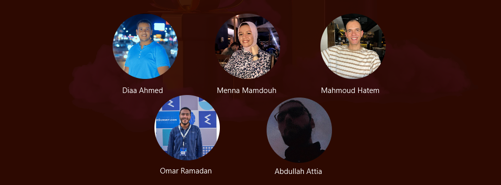
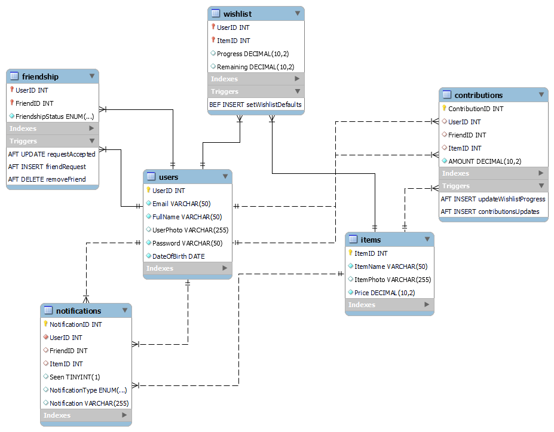
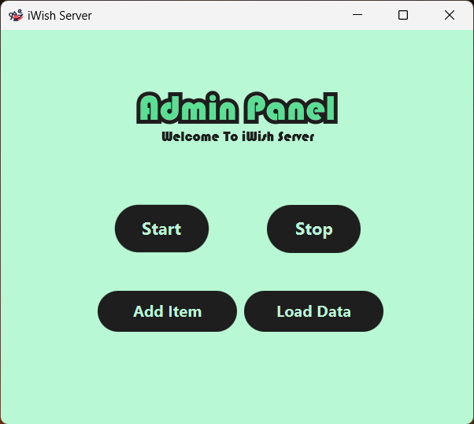
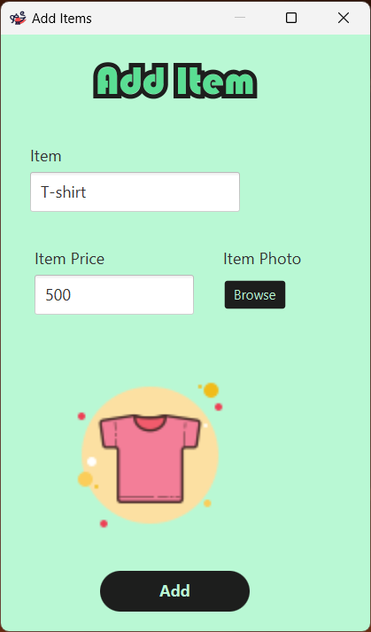
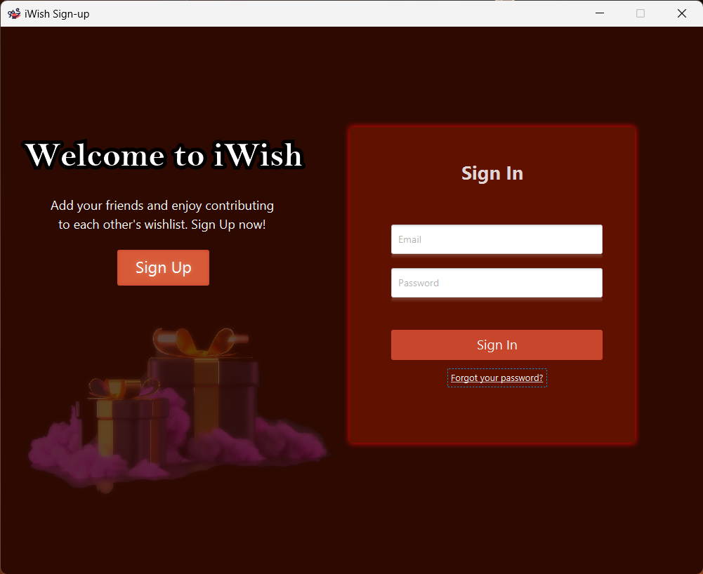
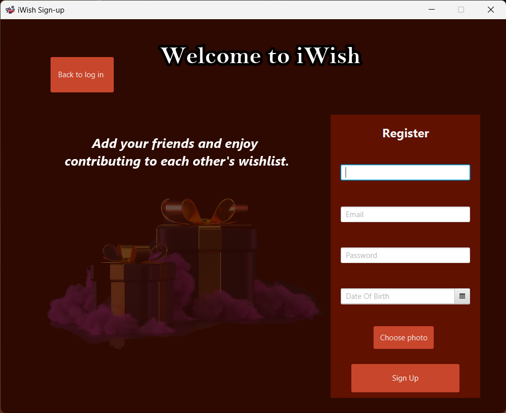

# i-Wish-Desktop-Application
`i-Wish` is a social platform that aims at bringing connections together and making the use of social media different and more fun. It was first released in _2024_ by a group of trainees in the Information Technology Institution.
<p align="center">

</p>

---

## Main Parts of i-Wish Desktop Application ##

`i-Wish` is a desktop application where the user adds friends, creates his wish list, checks his friends’ wish lists and makes his friends happy by contribution in buying them items from their wish lists.

### It's mainly consists of 3 parts: ###
- __Database__ &#8594; Contains all the information needed to be stored from the client-side or the server-side.
    <p align="center">
    
    </p>

    To know more information about the database schema, the information it stores, and how it works. [Check the database documentation file here](database/README.md)
  
- __Server__ &#8594; The entry point of our application. It's the place where all the clients can connect to and use our application easily. It's also the midpoint between the clients and the database.
    <p align="center">
    
    </p>

    - Using the server panel, we can start the server to let users connect to it. We can stop it for the purpose of enhancement or fixing bugs as well.
    - It's also contains 2 buttons, `Add Item` button is for the admin to add new items to our systems.
        <p align="center">
        
        </p>

    - The second button `Load Data` is for scraping new items from a website to offer variety of items.
  
- __Client__ &#8594; The actual application through which users can register, sign-in, add friends, create their own wishlist, and contribute to help their friends get the items they wish for.
    <p align="center">
    
    </p>

---

## How the application works ? ##

You can download the project and run it on your own machine by following the steps:
1. Load the [database](database/IWishDBBackup.sql) into your MySQL Server.
2. Download the [server](server/IWishServer/src/) project then attach the [libraries](server/IWishServer/libraries/) used in the server.  

   a. GSON library to control the communication between the server and the client.

   b. MySQL Connector library to be able to connect to the database.

3. Download the [client](client/IWishClient/src/) project and also attach the [libraries](client/IWishClient/libraries/) used in the client.
4. Open the two project in `NetBeans`:
    
   a. Open the [DBConnection](server/IWishServer/src/Server/DAO/DBConnection.java) and change the username and password of the connection to your MySQL username and password in the following line.
   ```java
   dbconnection = DriverManager.getConnection("jdbc:mysql://localhost:3306/iwishdb", "root", "admin");
   ```

   b. Run the [main](server/IWishServer/src/Main/Main.java) file of the server. Then start the server using the `Start` button.

   c. Run the [IWishClient](client/IWishClient/src/Main/IWishClient.java) file from the client project.
   
   d. Finally! Register with any number of users you wish and start enjoying your application!
    <p align="center">
    
    </p>

---