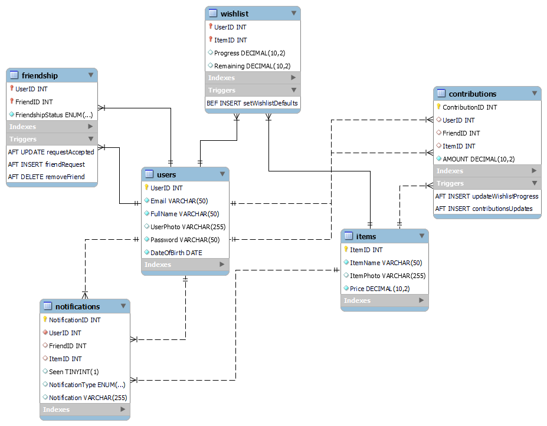

# i-Wish-Desktop-Application Database

i-Wish database schema consists of 6 tables. Each table represents an entity and stores some attributes which describe this entity and its relationships with the other entities.

<em>Database Schema of i-Wish Desktop Application</em>

`Users` table is responsible of storing information about the users of our application. It stores their emails, passwords, names, their profile photos, and when they were born.

`Items` table stores information about the items which each user can add in his/her wishlist. It contains the names of the items, photos of them, and their prices.

`Friendship` table represents the unary relationship of the `Users` table. It represents the relationship between the users which are on their friends list. This relationship may be _friendship_ if they're actual friends or _pending friendship_ if one of them hasn't accepted the other's friend request yet.

`Wishlist` table represents the relationship between `Users` table and `Items` table. It stores information about a user who _has_ any item in his/her wishlist, the progress of the contributions that happend on this item from his/her friends, and the remaining amount to get it.

`Contributions` table contains the information of any contribution happend from one of the user's friends on a specific item on his/her wishlist to help him/her get this item.

`Notifications` table has all the notifications of each user. Any notification can be an option of the following 5 options:
- __REQUEST_SENT__ &#8594; If one of the users sends a friend request to another user.
- __REQUEST_ACCEPTED__ &#8594; If the user accepts the friend request of another user.
- __SOMEONE_CONTRIBUTED__ &#8594; If one of the user's friends decided to contribute on one of his/her wishlist items.
- __FRIEND_GOT_ITEM__ &#8594; If the user's contribution helped a friend of him/her to get a specific item.
- __CONTRIBUTION_COMPLETED__ &#8594; If the contributions of one or more friends helped the user to get a specific item.

---

The `Notifications` table is generated within the database itself with the help of 6 triggers.
- `friendRequest` &#8594; This trigger is fired after the insertion on `Friendship` table, in other words once a user sends a friend request to another user.
- `requestAccepted` &#8594; This trigger is fired after the update process on `Friendship` table. Once a user accepted a friend request, the _friendshipStatus_ attribute turns to `Accepted` instead of `Pending`. Then the user gets a notification.
- `removeFriend` &#8594; This trigger is fired if a user denies a friend request of another user. At this moment the database removes the notification of the friend request.
- `setWishlistDefaults` &#8594; The only action of this trigger is to set the `Progress` attribute to `0` and the `Remaining` attribute to the price of the item once a user adds this item to his/her wishlist.
- `updateWishlistProgress` &#8594; This trigger is fired when any update on the `Contributions` table happend. It calculates the progress of the contributions happend on the targeted item of a specific user, and calculates the remaining amount to make this user get it as well.
- `contributionsUpdates` &#8594; This trigger does 3 tasks once a record is inserted on the `Contributions` table.
  - Tells the user that there's a contribution happend on an item on his/her wishlist with a specific amount from a friend of him/her.
  - Checks if the sent amount completed the price of the item or not. If so it tells this user that a friend or number of his/her friends get him an item.
  - It also tells the friends who contributed on this item that their contributions helped their friend to get the item.

---

i-Wish Application Database is built on __MySQL Server__ with the help of __MySQL Workbench__ tool. To view the source code of the database and implement it on your local version of __MySQL Server__ [click here](IWishDBBackup.sql).